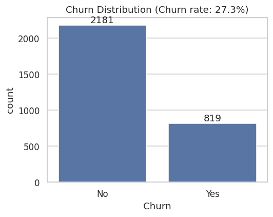
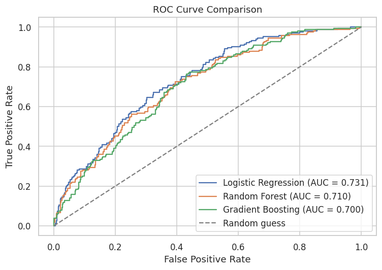
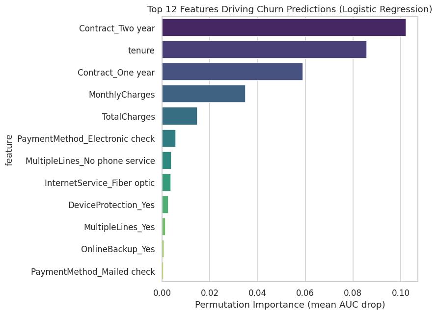

# Customer Churn Prediction & Retention Insights

Predicting telecom customer churn and translating model output into concrete
retention actions — not just a classifier, but an end-to-end analysis a
business team could actually use.



## Problem

Acquiring a new customer costs significantly more than retaining an existing
one, so being able to flag *which* customers are likely to churn — and *why*
— lets a retention team intervene before it's too late. This project builds
that pipeline: from raw customer data to a deployable-quality model to
plain-language business recommendations.

## Dataset

The dataset (`data/customer_churn.csv`, 3,000 customers) is **synthetically
generated** by [`src/generate_data.py`](src/generate_data.py) to mirror the
structure and feature relationships of real-world telecom churn data
(demographics, contract type, billing, service usage), with churn driven by
a realistic underlying risk model plus noise — landing at a **27.3% churn
rate**, in line with published telecom churn benchmarks. Generating rather
than downloading the data keeps the project 100% reproducible end-to-end and
avoids relying on an external dataset link that could break.

## Approach

1. **Exploratory Data Analysis** — churn distribution, tenure/charges/contract
   relationships, categorical service drivers, correlation analysis
2. **Preprocessing** — categorical encoding, feature scaling, stratified train/test split
3. **Modeling** — Logistic Regression, Random Forest, and Gradient Boosting compared head-to-head
4. **Handling class imbalance** — since only ~27% of customers churn, models
   are trained with balanced class weighting so they aren't biased toward
   just predicting "no churn"; the **F1 score** (not raw accuracy) is used to
   pick the best model, since missing an actual churner is more costly than
   a false alarm in a real retention setting
5. **Interpretability** — permutation importance to identify which features
   *actually* drive the model's predictions, translated into business
   recommendations

## Results

| Model | Accuracy | Precision | Recall | F1 | ROC-AUC |
|---|---|---|---|---|---|
| **Logistic Regression** | 0.632 | 0.402 | **0.713** | **0.514** | **0.731** |
| Gradient Boosting | 0.643 | 0.408 | 0.677 | 0.509 | 0.700 |
| Random Forest | 0.667 | 0.422 | 0.598 | 0.495 | 0.710 |

Logistic Regression was selected as the best model — it catches **71% of
customers who actually churn** (recall), which matters more for a retention
use case than raw accuracy.



## Key Business Insights

- **Contract type is the strongest churn signal** — month-to-month customers
  churn far more than annual/two-year contract holders. Incentivizing
  contract upgrades is likely the single highest-leverage retention action.
- **Tenure risk is front-loaded** — churn risk is highest in a customer's
  first year and drops sharply afterward, so retention effort should be
  concentrated in onboarding, not spread evenly.
- **Fiber optic customers churn more despite paying more**, hinting at a
  service quality or price-perception issue worth a targeted survey.
- **Missing tech support and electronic-check payment both correlate with
  higher churn** — proactive support outreach and autopay nudges are
  low-cost levers.



## Tech Stack

`Python` · `pandas` · `NumPy` · `scikit-learn` · `matplotlib` · `seaborn` · `Jupyter`

## Project Structure

```
customer-churn-prediction/
├── data/
│   └── customer_churn.csv        # generated dataset
├── notebooks/
│   └── churn_analysis.ipynb      # full EDA + modeling + interpretability walkthrough
├── src/
│   ├── generate_data.py          # synthetic data generator
│   └── train_model.py            # standalone script version of the pipeline
├── images/                       # exported charts (used in this README)
├── requirements.txt
└── README.md
```

## How to Run

```bash
git clone https://github.com/swetasaraswat/customer-churn-prediction.git
cd customer-churn-prediction
pip install -r requirements.txt

python src/generate_data.py     # generates data/customer_churn.csv
python src/train_model.py       # trains & compares models, prints results

# or open the full walkthrough:
jupyter notebook notebooks/churn_analysis.ipynb
```

## Future Improvements

- Hyperparameter tuning (GridSearchCV / Optuna) for the Logistic Regression and Gradient Boosting models
- SHAP values for per-customer explanations, not just global feature importance
- A simple Streamlit app to let a non-technical user query churn risk for a given customer profile

---

**Author:** Sweta Saraswat — [GitHub](https://github.com/swetasaraswat) · [LinkedIn](https://linkedin.com/in/swetasaraswat) · [Medium](https://medium.com/@swetasaraswat2)
